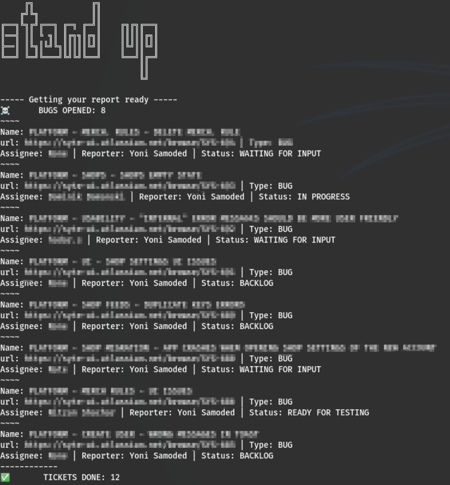

# jira_qa_stand_up
Simple QA report for stand up meetings

## Configuration
Create config file `config.json` in project directory
Config structure:

`{
    "server":"https://full_url_to_your_jira_server",
    "api_path": "/rest/api/3",
    "auth":{
        "email": "your@email.com",
        "password": "password"
    },
    "project":"project_name",
    "boardId": int
}`

## Usage

Execute `python3 stand_up.py` from project directory

## Dependencies

`python3 -m pip install requests`